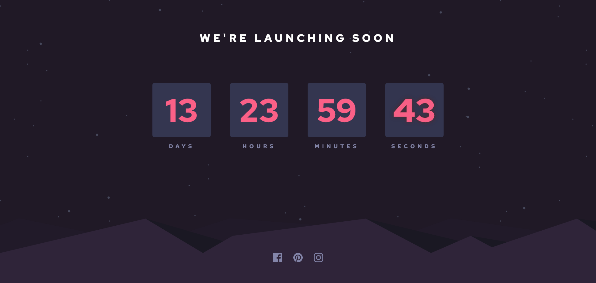

# Frontend Mentor - Launch countdown timer solution

This is a solution to the [Launch countdown timer challenge on Frontend Mentor](https://www.frontendmentor.io/challenges/launch-countdown-timer-N0XkGfyz-).

## Table of contents

- [Overview](#overview)
  - [The challenge](#the-challenge)
  - [Screenshot](#screenshot)
  - [Links](#links)
- [My process](#my-process)
  - [Built with](#built-with)
  - [What I learned](#what-i-learned)
  - [Useful resources](#useful-resources)
- [Author](#author)

## Overview

### The challenge

Users should be able to:

- See hover states for all interactive elements on the page
- See a live countdown timer that ticks down every second (start the count at 14 days)
- **Bonus**: When a number changes, make the card flip from the middle

### Screenshot

### Links

- You can take a look [here](https://darrowv.github.io/launch-countdown-timer)

## My process

### Built with

- JavaScript
- Semantic HTML5 markup
- CSS custom properties
- Flexbox
- CSS Grid
- Variable Font
- DOM manipulations
- Media queries

### What I learned

- ***

### Useful resources

- [w3schools: how to create countdown timer](https://www.w3schools.com/howto/howto_js_countdown.asp)
- [********\*\*\*\*********](*********************************************)

## Author

- Github - [@darrowv](https://github.com/darrowv)
- Frontend Mentor - [@darrowv](https://www.frontendmentor.io/profile/darrowv)
- LinkedIn - [Nasyr Akhmadov](https://linkedin.com/in/darrowv)
- Telegram - [Muhammad Nasyr](https://t.me/m_nasyr)
